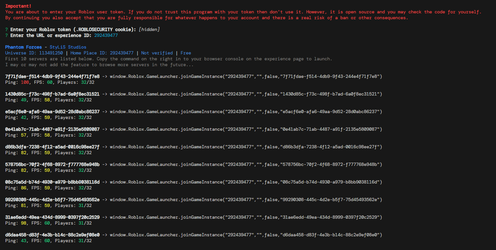

# Roblox Server Finder

## Description

Simple and nifty node.js program to find Roblox servers. Each server is listed with its latency from (I believe) Roblox's servers, the FPS and the amount of players. Each listing also includes a command that can be executed in your browser's console when its opened to the game page.

## Usage

```sh
git clone https://github.com/Avoxel284/rblxserverfinder
cd rblxserverfinder
npm i
node .
```

## Example 
